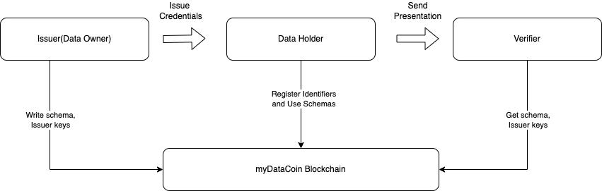

# 🤖 Tech Stack


**Disclaimer:** The development team is working diligently, and the documentation will be updated with each new release.


* [Protocol Architecture](tech-stack.md#protocol-architecture)
* [Self-Sovereign Identity](tech-stack.md#self-sovereign-identity)

## Overview

MyDataCoin is in the process of developing a public blockchain that utilizes the **Cosmos SDK** and **Tendermint Core** technologies. The Cosmos SDK provides a framework for building customizable, modular blockchains that can interoperate with one another. It also includes tools for developing decentralized applications (dApps) and smart contracts. Tendermint Core is a consensus engine that uses the Tendermint BFT (Byzantine Fault Tolerance) algorithm to ensure secure and fast transaction processing on the blockchain. By utilizing these technologies, MyDataCoin aims to create a scalable and interoperable blockchain platform that can be used for a variety of decentralized applications, including data sharing and privacy-preserving technologies.

<figure><figcaption>
MDC Tech Stack
</figcaption></figure>

The Tendermint Core is a high-performance, consistent, flexible, and secure **consensus** module with strict fork accountability. It relies on [Proof-of-Stake (PoS)](https://eprint.iacr.org/2019/1460.pdf) with delegation and  [Practical Byzantine Fault Tolerance](https://github.com/tendermint/tendermint). This advantage provides us a possibility to develop a high-performance, consistent and secure decentralized network.

The Tendermint BFT provides security guarantees, including:

1. **Forks** are never created, provided that half or more validators are honest.
2. **Strict accountability** for fork creation allows determining liability.
3. Transactions are **finalized** as soon as a block is created.\

The Cosmos SDK provides a rich set of modules that address common concerns such as governance, tokens, other standards, and interactions with other blockchains through the Inter-Blockchain Communication Protocol (IBC). Some production-grade modules such as Auth, Bank, Distribution, Mint, etc, are going to be used in MDC.

The signing of a smart agreement between the participants of the system should be carried out using CosmWasm. CosmWasm is a new smart contract platform created for the Cosmos ecosystem.

### Protocol Architecture

To elaborate further, the MyDataCoin network will serve as the foundation for a protocol that enables secure and decentralized connectivity between data owners and data holders. This protocol will utilize a decentralized linking mechanism that allows data owners to connect with multiple data holders in a secure and transparent manner.

The MyDataCoin Bridge implementation will serve as the link between the main network and the data holders, ensuring that data is transmitted securely and efficiently. The MyDataCoin Mapper solution will be used to combine multiple accounts from different data holders into one, providing a unified view of the data.

The goal of this protocol is to provide a decentralized and transparent data sharing mechanism that empowers individuals to control their personal data and securely share it with trusted parties. By leveraging the MyDataCoin network and associated technologies, this protocol aims to improve data privacy and security while enabling more efficient and effective data sharing.

<figure><figcaption>
MDC Main Scheme
</figcaption></figure>

### Self-Sovereign Identity

Self-Sovereign Identity (SSI) is a new approach to digital identity that puts individuals in control of their own identity data. It is built on three foundational technologies: blockchain, Decentralized Identifiers (DIDs), and Verifiable Credentials (VCs).

Blockchain provides the decentralized infrastructure for SSI, allowing individuals to securely store and manage their identity data on a distributed ledger. This eliminates the need for centralized identity providers, which can be vulnerable to data breaches and hacks.

Decentralized Identifiers (DIDs) are a type of identifier that is independent of any centralized authority or registry. DIDs are unique, cryptographically secure identifiers that are owned and controlled by the individual they represent. DIDs enable individuals to create and manage their own identity data, and to selectively share that data with others.

Verifiable Credentials (VCs) are digital credentials that contain information about an individual's identity, such as their name, date of birth, and proof of address. VCs are issued by trusted parties, such as governments, educational institutions, or employers, and are cryptographically signed to ensure their authenticity. VCs can be stored and managed by the individual they represent, and can be selectively shared with others as needed.

Together, these three technologies provide the foundation for a new paradigm of digital identity that is secure, decentralized, and empowers individuals to control their own identity data.

\

<figure><figcaption></figcaption></figure>

**Why SSI?**

* A secure and digital peer-to-peer channel is established between ID Issuer, ID Owner and ID Verifier. When credentials are exchanged not even the Self-Sovereign Identity system provider knows what is being exchanged. Credential issuing becomes simpler and faster.
* SSI Credentials are tamper-proof through the use of cryptography.
* They are private and under your control. SSI uses Selective Identity disclosure technology.
* Self-Sovereign Identity credentials can be verified anywhere, at any time. Even if the issuer does not exist anymore (with the exception of situations where the issuance of credentials happened using Private DIDs and the DID of the issuer was not written on the ledger).
* **Personal Data** is not stored on centralized servers. Meaning that for hackers to steal 50 million digital identity records they would have to hack those 50 million people individually. Considerably more difficult.
* Self-Sovereign Identity **tries to abolish multiple passwords**. You just need to know your wallet password.

\
A Decentralized Identifier ([DID](https://www.w3.org/TR/did-core/)) is a unique identifier that is going to be used in the MyDataCoin ecosystem. Data collectors can issue signed credentials using a DID to users, allowing them to share their data with other data consumers. The authenticity of the credentials can be verified by referring to the DID document on the MyDataCoin network. The MyDataCoin-based DID is also used to ensure the reliability and integrity of the shared data. By utilizing DIDs, MyDataCoin aims to establish a self-sovereign identity system that empowers individuals to control their own data and share it with others in a secure and transparent manner.

[Decentralized Identifiers](https://www.w3.org/TR/did-core/#dfn-decentralized-identifiers) are a component of larger systems, such as the Verifiable Credentials ecosystem \[[VC-DATA-MODEL](https://www.w3.org/TR/did-core/#bib-vc-data-model)], which influenced the design goals for this specification. The design goals for Decentralized Identifiers are summarized here.

| Decentralization | Eliminate the requirement for centralized authorities or single point failure in identifier management, including the registration of globally unique identifiers, public verification keys, [services](https://www.w3.org/TR/did-core/#dfn-service), and other information. |
| ---------------- | ---------------------------------------------------------------------------------------------------------------------------------------------------------------------------------------------------------------------------------------------------------------------------- |
| Control          | Give entities, both human and non-human, the power to directly control their digital identifiers without the need to rely on external authorities.                                                                                                                           |
| Privacy          | Enable entities to control the privacy of their information, including minimal, selective, and progressive disclosure of attributes or other data.                                                                                                                           |
| Security         | Enable sufficient security for requesting parties to depend on [DID documents](https://www.w3.org/TR/did-core/#dfn-did-documents) for their required level of assurance.                                                                                                     |
| Proof-based      | Enable [DID controllers](https://www.w3.org/TR/did-core/#dfn-did-controllers) to provide cryptographic proof when interacting with other entities.                                                                                                                           |
| Discoverability  | Make it possible for entities to discover [DIDs](https://www.w3.org/TR/did-core/#dfn-decentralized-identifiers) for other entities, to learn more about or interact with those entities.                                                                                     |
| Interoperability | Use interoperable standards so [DID](https://www.w3.org/TR/did-core/#dfn-decentralized-identifiers) infrastructure can make use of existing tools and software libraries designed for interoperability.                                                                      |
| Portability      | Be system- and network-independent and enable entities to use their digital identifiers with any system that supports [DIDs](https://www.w3.org/TR/did-core/#dfn-decentralized-identifiers) and [DID methods](https://www.w3.org/TR/did-core/#dfn-did-methods).              |
| Simplicity       | Favor a reduced set of simple features to make the technology easier to understand, implement, and deploy.                                                                                                                                                                   |
| Extensibility    | Where possible, enable extensibility provided it does not greatly hinder interoperability, portability, or simplicity.                                                                                                                                                       |
