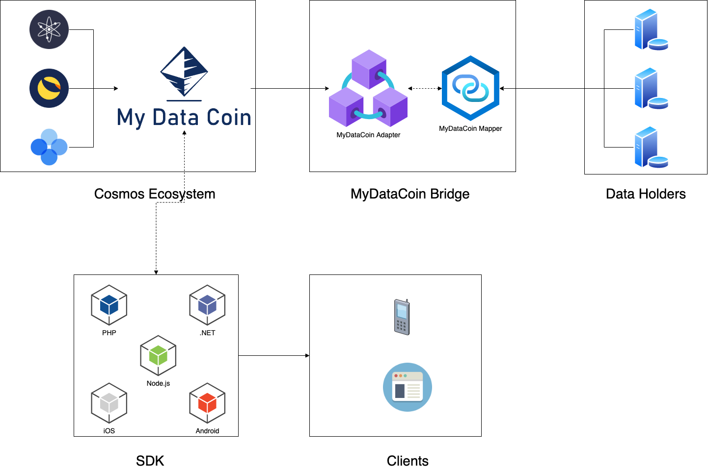

# 🤖 Tech Stack


**Disclaimer:** The development team is working hard. The documentation will be updated as new releases are released.


* [Protocol Architecture](tech-stack.md#protocol-architecture)
* [Self-Sovereign Identity](tech-stack.md#self-sovereign-identity)

## Overview

MyDataCoin is developing a public blockchain based on Cosmos SDK and the Tendermint Core.

<figure><figcaption>
MDC Tech Stack
</figcaption></figure>

The Tendermint Core is a high-performance, consistent, flexible, and secure **consensus** module with strict fork accountability. It relies on [Proof-of-Stake (PoS)](https://eprint.iacr.org/2019/1460.pdf) with delegation and  [Practical Byzantine Fault Tolerance](https://github.com/tendermint/tendermint). This advantage provides us a possibility to develop a high-performance, consistent and secure decentralized network.

The Tendermint BFT provides security guarantees, including:

1. **Forks** are never created, provided that half or more validators are honest.
2. **Strict accountability** for fork creation allows determining liability.
3. Transactions are **finalized** as soon as a block is created.\

The Cosmos SDK provides a rich set of modules that address common concerns such as governance, tokens, other standards, and interactions with other blockchains through the Inter-Blockchain Communication Protocol (IBC). Some production-grade modules such as Auth, Bank, Distribution, Mint, etc, are going to be used in MDC.

The signing of a smart agreement between the participants of the system should be carried out using CosmWasm. CosmWasm is a new smart contract platform created for the Cosmos ecosystem.

### Protocol Architecture

The basis of this protocol will be based on the MyDataCoin network. The MyDataCoin network will be a protocol that implements a binding solution for connecting to data holders. The mechanism is a basic decentralized linking solution for interaction between data owners and data holders.

The protocol intends to use the MyDataCoin Bridge implementation, which is the link between the main network and the data holders. It is also planned to use a “MyDataCoin Mapper” solution, which is necessary to combine many accounts from different data holders into one.

<figure><figcaption>
Protocol Architecture
</figcaption></figure>

### Self-Sovereign Identity

Blockchain technology, Decentralized Identifiers and Verifiable Credentials are the 3 pillars of Self-Sovereign Identity.

<figure><figcaption></figcaption></figure>

**Why SSI?**

* A secure and digital peer-to-peer channel is established between ID Issuer, ID Owner and ID Verifier. When credentials are exchanged not even the Self-Sovereign Identity system provider knows what is being exchanged. Credential issuing becomes simpler and faster.
* SSI Credentials are tamper-proof through the use of cryptography.
* They are private and under your control. SSI uses Selective Identity disclosure technology.
* Self-Sovereign Identity credentials can be verified anywhere, at any time. Even if the issuer does not exist anymore (with the exception of situations where the issuance of credentials happened using Private DIDs and the DID of the issuer was not written on the ledger).
* **Personal Data** is not stored on centralized servers. Meaning that for hackers to steal 50 million digital identity records they would have to hack those 50 million people individually. Considerably more difficult.
* Self-Sovereign Identity **tries to abolish multiple passwords**. You just need to know your wallet password.

\
[DID](https://www.w3.org/TR/did-core/) is going to be used as a unique identifier in the MyDataCoin ecosystem. Data collectors can issue signed credentials using a decentralized identifier (DID) to users, enabling them to share their data with other data consumers. Anyone can check the authentication data by referring to the DID document on MyDataCoin. Additionally, the MyDataCoin-based DID is used to guarantee data reliability.

[Decentralized Identifiers](https://www.w3.org/TR/did-core/#dfn-decentralized-identifiers) are a component of larger systems, such as the Verifiable Credentials ecosystem \[[VC-DATA-MODEL](https://www.w3.org/TR/did-core/#bib-vc-data-model)], which influenced the design goals for this specification. The design goals for Decentralized Identifiers are summarized here.

| Decentralization | Eliminate the requirement for centralized authorities or single point failure in identifier management, including the registration of globally unique identifiers, public verification keys, [services](https://www.w3.org/TR/did-core/#dfn-service), and other information. |
| ---------------- | ---------------------------------------------------------------------------------------------------------------------------------------------------------------------------------------------------------------------------------------------------------------------------- |
| Control          | Give entities, both human and non-human, the power to directly control their digital identifiers without the need to rely on external authorities.                                                                                                                           |
| Privacy          | Enable entities to control the privacy of their information, including minimal, selective, and progressive disclosure of attributes or other data.                                                                                                                           |
| Security         | Enable sufficient security for requesting parties to depend on [DID documents](https://www.w3.org/TR/did-core/#dfn-did-documents) for their required level of assurance.                                                                                                     |
| Proof-based      | Enable [DID controllers](https://www.w3.org/TR/did-core/#dfn-did-controllers) to provide cryptographic proof when interacting with other entities.                                                                                                                           |
| Discoverability  | Make it possible for entities to discover [DIDs](https://www.w3.org/TR/did-core/#dfn-decentralized-identifiers) for other entities, to learn more about or interact with those entities.                                                                                     |
| Interoperability | Use interoperable standards so [DID](https://www.w3.org/TR/did-core/#dfn-decentralized-identifiers) infrastructure can make use of existing tools and software libraries designed for interoperability.                                                                      |
| Portability      | Be system- and network-independent and enable entities to use their digital identifiers with any system that supports [DIDs](https://www.w3.org/TR/did-core/#dfn-decentralized-identifiers) and [DID methods](https://www.w3.org/TR/did-core/#dfn-did-methods).              |
| Simplicity       | Favor a reduced set of simple features to make the technology easier to understand, implement, and deploy.                                                                                                                                                                   |
| Extensibility    | Where possible, enable extensibility provided it does not greatly hinder interoperability, portability, or simplicity.                                                                                                                                                       |
